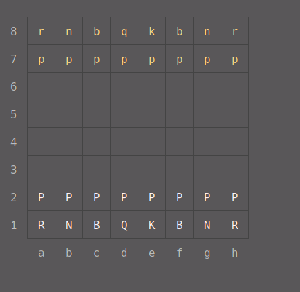

# :chess_pawn: mchess

[](https://github.com/henriq20/mchess/actions/workflows/tests.yml)
[](https://www.npmjs.com/package/mchess)
[](https://opensource.org/licenses/MIT)

A complete Chess library.

## Table of contents
- [Installation](#installation)
- [Usage](#usage)
- [Playing the Demo](#playing-the-demo)
- [API](#api)
  - [constructor](#constructor)
  - [render](#render)
  - [place](#place)
  - [takeOut](#takeout)
  - [fen](#fen)
  - [piece](#piece)
  - [square](#square)
  - [move](#move)
  - [undo](#undo)
  - [moves](#moves)
  - [canMove](#canmove)
  - [isCheck](#ischeck)
  - [isCheckmate](#ischeckmate)
  - [isStalemate](#isstalemate)
  - [isGameOver](#isgameover)
  - [isDraw](#isdraw)
  - [isAttacked](#isattacked)
  - [clear](#clear)
  - [reset](#reset)
- [Contributing](#contributing)

## Installation

Install `mchess` using npm.

```shell
npm install mchess
```

Or install using yarn.

```shell
yarn add mchess
```

## Usage

ES6 imports or CommonJS requires are supported.

```JavaScript
import Chess from 'mchess';
import inquirer from 'inquirer';

const chess = new Chess();

while (!chess.isGameOver()) {
    console.clear();
    console.log(chess.render());

    const answers = await inquirer.prompt([
        {
            type: 'input',
            name: 'move',
            message: 'Enter a move:',
            prefix: ''
        }
    ]);

    chess.move(answers.move);
}
```


## Playing the Demo
To play the demo above, you just need to run the following commands in your terminal:
```shell
git clone git@github.com:henriq20/mchess.git
cd mchess/demo
npm install && node .
```

## API

#### constructor
You can use [FEN](https://www.chess.com/terms/fen-chess) to easily denote a position.

```JavaScript
const chess = new Chess('rnbqkbnr/pppppppp/8/8/8/8/PPPPPPPP/RNBQKBNR w KQkq - 0 1');
```

### render
Gets the board as a string.

```JavaScript
console.log(chess.render());
```



You can customize how each square, file, rank and separator is displayed.

**Example:**

```JavaScript
chess.render({
    square: (square) => square.piece ? square.piece.symbol : ' ',
    rank: (rank) => chalk.green(rank),
    file: (file) => chalk.red(file),
    separator: (separator) => chalk.gray(separator)
});
```

#### place
Places a piece on the board.

```JavaScript
chess.place('P', 'a3'); // White pawn on square a3
```

Every piece is denoted by a single letter. An uppercase letter denotes white pieces, while black pieces use lowercase.

| Symbol | Piece        |
| ------ | ------------ |
| P      | White Pawn   |
| N      | White Knight |
| R      | White Rook   |
| B      | White Bishop |
| Q      | White Queen  |
| K      | White King   |
| p      | Black Pawn   |
| n      | Black Knight |
| r      | Black Rook   |
| b      | Black Bishop |
| q      | Black Queen  |
| k      | Black King   |

#### takeOut
Removes a piece from the board.

```JavaScript
const removedPiece = chess.takeOut('a3');

console.log(removedPiece); // { type: 'p', color: 'white', square: 'a3' }
```

### fen
Converts the current state of the board to FEN.

```JavaScript
chess.clear();

console.log(chess.fen()); // 8/8/8/8/8/8/8/8 w - - 0 1

chess.place('P', 'a2');

console.log(chess.fen()); // 8/8/8/8/8/8/P7/8 w - - 0 1
```

#### piece
Gets the piece from the specified square.

```JavaScript
const rook = chess.piece('a1');

console.log(rook); // { type: 'r', color: 'white', square: 'a1' }
```

#### square
Gets the square on the specified position.

```JavaScript
const a4 = chess.square('a4');

console.log(a1); // { name: 'a4', piece: null }
```

#### move
Moves a piece to the specified location.

You can use [SAN](https://www.chess.com/article/view/chess-notation#algebraic-notation) or pass an object containing the square of origin and arrival.

```JavaScript
// SAN notation
chess.move('e4'); // White pawn moves to e4
chess.move('d5'); // Black pawn moves to d5
chess.move('exd5'); // White pawn captures the pawn on d5

// Same moves as above but with a simpler notation
chess.move({ from: 'e2', to: 'e4' });
chess.move({ from: 'd7', to: 'd5' });
chess.move({ from: 'e4', to: 'd5' });
```

#### undo
Undoes the last move.

```JavaScript
chess.move('e4');
chess.undo();

console.log(chess.piece('e4')); // null
```

#### moves
Gets the possible moves that a piece can make.

```JavaScript
chess.moves('e2'); // [ { from: 'e2', to: 'e3' }, { from: 'e2', to: 'e4' } ]

// You can also get SAN moves
chess.moves({ square: 'e2', san: true }); // [ 'e3', 'e4' ]
chess.moves({ square: 'g1', san: true }); // [ 'Nf3', 'Nh3' ]
```

#### canMove
A simpler way to check if a piece can move to the specified square.

```JavaScript
// Indicates whether any piece of the current turn can move.
chess.canMove();

// Indicates whether the piece on square e2 can move at all.
chess.canMove({ from: 'e2' });

// Indicates whether the piece on square e2 can to the square e4.
chess.canMove({ from: 'e2', to: 'e4' });
```

#### isCheck
Indicates whether the king is attacked.

```JavaScript
const chess = new Chess('K7/8/2b5/8/8/8/8/k7 w - - 0 1');

console.log(chess.isCheck()); // true
```

#### isCheckmate
Indicates whether the king is attacked and none of the pieces have legal moves to make.

```JavaScript
const chess = new Chess('rnbqkbnr/ppppp2p/8/5ppQ/4P3/8/PPPP1PPP/RNB1KBNR b KQkq - 0 2');

console.log(chess.isCheckmate()); // true
```

#### isStalemate
Indicates whether the king is not in check and none of the piece have legal moves to make, resulting in a draw.

```JavaScript
const chess = new Chess('K7/8/8/8/8/8/5Q2/7k b - - 0 1');

console.log(chess.isStalemate()); // true
```

### isGameOver
Indicates whether the game has ended because of checkmate or a draw.

```JavaScript
const chess = new Chess('8/3R3p/Q5k1/6p1/6P1/4Q2P/5PK1/8 b - - 0 41');

console.log(chess.isGameOver()); // true
```

### isDraw
Indicates whether the game has ended because of a draw.

```JavaScript
const chess = new Chess('3Q4/1k6/5RN1/3p4/3P4/Q1K5/8/8 b - - 4 64');

console.log(chess.isDraw()); // true
```

### isAttacked
Indicates whether the given piece is attacked.

```JavaScript
const pawn = chess.piece('e2');

console.log(chess.isAttacked(pawn)); // false

chess.move('e4');
chess.move('d5');

console.log(chess.isAttacked(pawn)); // true
```

### clear
Removes all the pieces from the board.

```JavaScript
chess.clear();

console.log(chess.history); // []
console.log(chess.piece('a1')); // null
```

### reset
Works similarly to the ```clear``` function, but it also places the pieces in their default position

```JavaScript
chess.reset();

console.log(chess.history); // []
console.log(chess.piece('a1')); // { type: 'r', color: 'white', square: 'a1' }
```

## Contributing
Pull requests are welcome. For major changes, please open an issue first to discuss what you would like to change.

Please make sure to update tests as appropriate.

